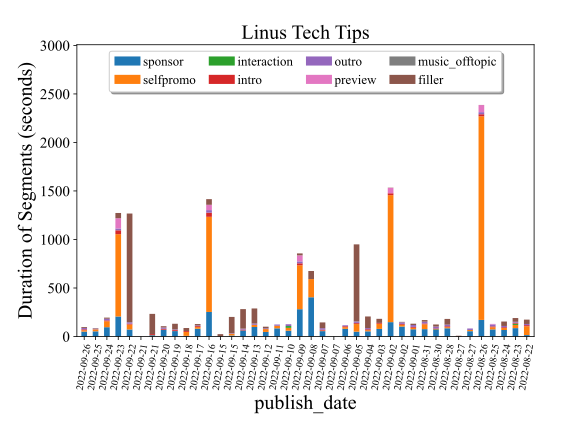
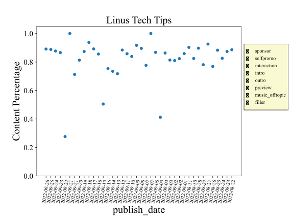

# SponsorBlockStats

This repo contains tools for visualization of SponsorBlock segments and their statistics across a given YouTube channel.

## Goals

The main purpose of this repo was to familiarize myself with the Pandas python library and to get some experience with interactive plots in Matplotlib. Additionally, I wanted to create some tools for feature engineering that could potentially be used in a future data science project.

## SponsorBlock

SponsorBlock is a [Chrome extension](https://sponsor.ajay.app/), created in July of 2019 by Ajay Ramachandran, which allows users to automatically skip sponsorship segments in YouTube videos. It relies on a crowdsourced approach where users submit segments to a database, which can be voted on by other users, with the highest voted segments being distributed to the general userbase

<p align="center">
	
</p>


At the time of writing it has X active users, Y total user submited segments, and has saved people a upwards of Z years in wasted time. 


Support exists for multiple segments types including
- [Sponsor](https://youtu.be/siSP4X_94M0?t=157)
	- *Before we go any further I've got to tell you a little bit about this video's sponsor, Helix Sleep*
- [Unpaid/Self Promotion](https://youtu.be/HCXQzLbDrgs?t=1059)
	- *Merch Sales. We've got everything from pillows to t-shirts to plushies, to the upcoming backpack*
- [Interaction Reminder](https://youtu.be/qDMY_n5b348?t=321)
	- *If you are enjoying this video, than a sub would be elec*
- [Intermission/Intro Animation](https://youtu.be/9XozhdsYHDc?t=23)
	- *And we are off to a really good start here, as you can plainly see*
- [Endcards/Credits](https://youtu.be/-wpHszfnJns?t=1759)
	- *So are you like new around here, or...? (Made by Brian David Gilbert)*
- [Preview/Recap](https://www.youtube.com/watch?v=UOJ4IS0gSw0?t=0)
	- *Good Morning, or should I say goodnight. It is day 9 of trying to cross America starting from one penny to deliver it to Mr. Beast ...*
- [Music: Non-Music Section](https://www.youtube.com/watch?v=FLGCGc7sAUw?t=0)
	- *Welcome to match made, home of the perfect woman. Come on in and decide the girl of your dreams ... (Bella Poarch - Build a B\*tch)*
- [Point of Interest, Highlight](https://www.youtube.com/watch?v=7YuiFlhe8j4?t=140)
	- *Yes, can confirm, the major YouTuber that we sponsored to do a video about the LTT screwdriver, or featuring the LTT screwdriver, was Marques*
- [Filler](https://youtu.be/HCXQzLbDrgs?t=100)
	- *I make sure their shoots happen on time, and when they do I get ice-cream sandwhiches for everyone*

All of this comes together to provide an opensource, publicly validated database of information about hundreds of thousands of videos all across YouTube.

## Example: Linus Tech Tips

Linus Tech Tips is a popular channel and is well known for having multiple sponsored segments per video, as well as frequently promoting their merchandise.

<p align="center">
	
</p>

<p align="center">
	
</p>

## Requirements
The only specialty packages required is the Python wrapper for the SponsorBlock API
- ```sponsorblock.py v0.2.2```. See <https://github.com/wasi-master/sponsorblock.py>.