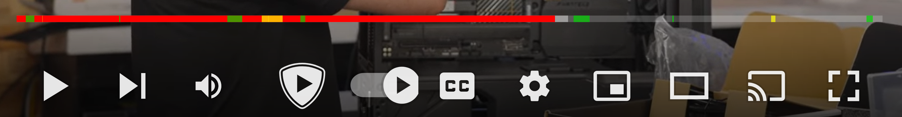

# SponsorBlockStats

This repo contains tools for visualization of SponsorBlock segments and their statistics across a given YouTube channel.

## SponsorBlock

SponsorBlock is a [Chrome extension](https://sponsor.ajay.app/), created in July of 2019 by Ajay Ramachandran, which allows users to automatically skip sponsorship segments in YouTube videos. It relies on a crowdsourced approach where users submit segments to a database, which can be voted on by other users, with the highest voted segments being distributed to the general userbase. 

	

As of 2022 it has added support for multiple segments types